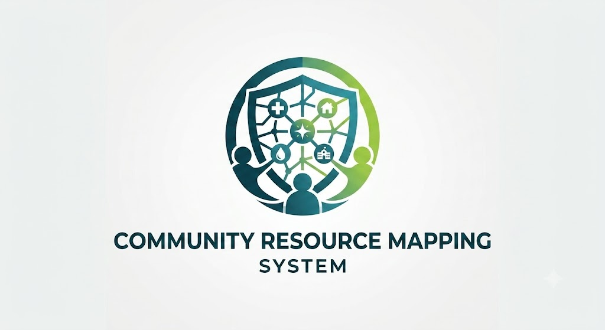
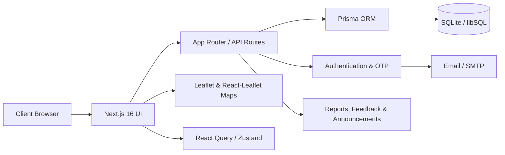
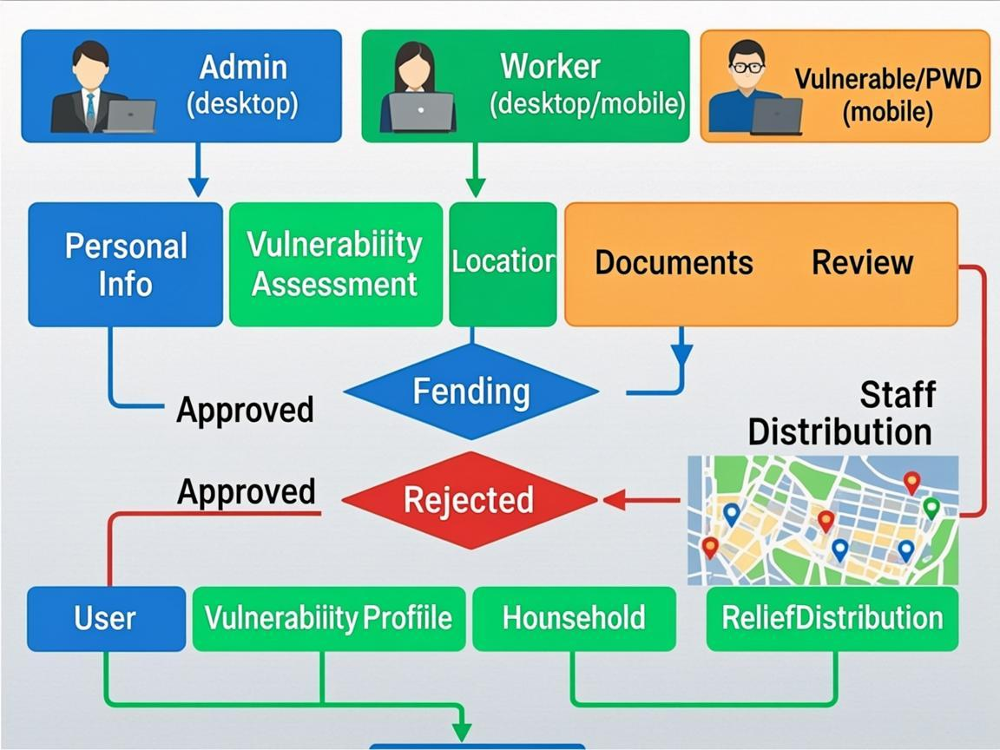
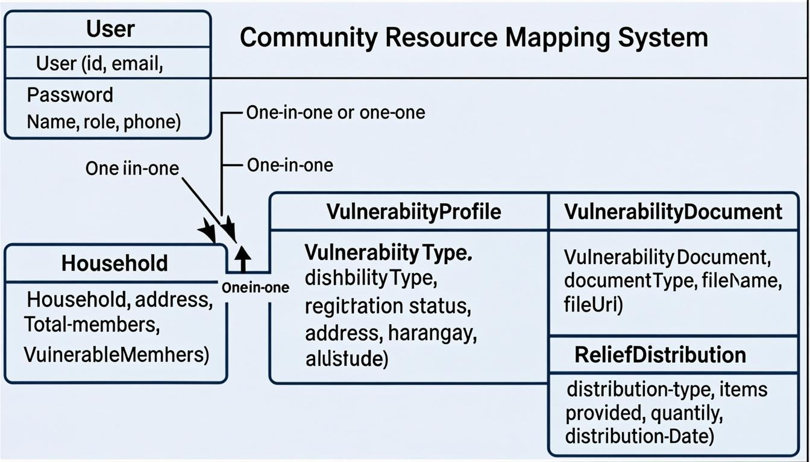

<div align="center">



# Community Resource Mapping System

### San Policarpo, Eastern Samar

A modern web-based platform for vulnerable citizen registration, relief distribution tracking, municipal announcements, feedback, reporting, and interactive community mapping.

<p>
  <a href="https://community-resource-mapping.vercel.app"><strong>🌐 Live System</strong></a>
  &nbsp;•&nbsp;
  <a href="./LOCAL_SETUP_GUIDE.md"><strong>⚙️ Local Setup</strong></a>
  &nbsp;•&nbsp;
  <a href="./data_dictionary.md"><strong>📚 Data Dictionary</strong></a>
</p>

<p>
  
  
  
  
  
  
  
</p>

</div>

---

## ✨ About the Project

The **Community Resource Mapping System (CRMS)** is an academic capstone project focused on improving the way community records, vulnerable citizen information, relief activities, announcements, and geographic data are organized for **San Policarpo, Eastern Samar**.

The system combines role-based workflows with interactive maps, reporting tools, guided walkthroughs, and operational history so information can be reviewed from one coordinated workspace.

> **Project focus:** clearer records, easier field coordination, better visibility of vulnerable households, and more organized municipal relief workflows.

---

## 👥 Role-Based Experience

<table>
<tr>
<td width="33%" valign="top">

### 🛡️ Administrator

- Review and approve registrations
- Manage user accounts
- Approve relief distribution records
- Review Operations History
- Publish announcements
- Respond to feedback
- View analytics and maps
- Generate daily reports

</td>
<td width="33%" valign="top">

### 🧰 Worker

- Register vulnerable citizens
- Record relief distributions
- Review personal relief records
- View Activity History
- Write field notes
- Read community updates
- Generate daily reports

</td>
<td width="33%" valign="top">

### 👤 Vulnerable Citizen

- Review personal information
- View relief history
- Read official community updates
- Search and filter announcements
- Submit feedback
- Follow guided in-app help

</td>
</tr>
</table>

---

## 🧭 Core Modules

| Module | What it does |
|---|---|
| **Overview Dashboard** | Shows operational counts, alerts, recent registrations, map activity, and quick status information. |
| **Approval Center** | Central review area for vulnerable citizen applications and validation workflows. |
| **Registrations** | Manages vulnerable citizen profiles, supporting information, map location, and registration status. |
| **Relief Approval** | Reviews field-submitted relief distribution records before approval or rejection. |
| **Operations History** | Combines relief history and municipal events with search, type, status, barangay, audience, and date filters. |
| **Announcements** | Publishes official notices with priority, target audience, event details, reusable presets, and frequent-message suggestions. |
| **Feedback** | Receives and manages citizen or worker feedback and administrator responses. |
| **Analytics** | Visualizes registrations, assistance activity, vulnerability patterns, and other operational data. |
| **Vulnerable Map** | Displays approved vulnerable citizen locations for authorized planning and coordination. |
| **Daily Reports** | Generates date-based operational reports for review and printing. |
| **Guided Walkthroughs** | Contextual guides explain major sections and newly added controls directly inside the system. |

---

## 🗺️ Mapping & Community Data

CRMS uses **Leaflet / React-Leaflet** for map-based workflows and geographic visualization.

The mapping experience includes:

- household and vulnerable citizen locations
- interactive markers
- map-based registration support
- municipal viewing limits
- map-driven assistance review
- lightweight rendering improvements for smoother marker interaction

> The current configured map limits are application viewing bounds and should not be treated as an official cadastral or legal municipal boundary.

---

## 🧑‍🏫 Built-In Guided Walkthroughs

The system includes contextual walkthroughs instead of relying only on a separate manual.

Guides are available across major Admin, Worker, and Citizen workflows, including:

- dashboard navigation
- registration and approval
- relief workflows
- Operations / Activity History
- announcements and reusable presets
- announcement search and date filters
- analytics
- vulnerable map
- feedback
- daily reports
- profile settings

The walkthrough system is designed to explain a feature **where it is used**, while avoiding automatic submission, deletion, approval, or other destructive actions.

---

## 🏗️ System Architecture



<details>
<summary><strong>View project diagrams</strong></summary>

<br />

### System Flowchart



### Database Schema



</details>

---

## 🧰 Technology Stack

<table>
<tr>
<td width="50%" valign="top">

### Frontend

- **Next.js 16.1**
- **React 19**
- **TypeScript 5**
- **Tailwind CSS 4**
- **shadcn/ui + Radix UI**
- **Framer Motion**
- **Lucide React**
- **React Hook Form**
- **Zod**

</td>
<td width="50%" valign="top">

### Data & Platform

- **Prisma 6.11**
- **SQLite / libSQL**
- **TanStack Query**
- **Zustand**
- **Leaflet / React-Leaflet**
- **MapLibre GL**
- **Recharts**
- **bcryptjs**
- **Nodemailer / SMTP**
- **Vercel**

</td>
</tr>
</table>

---

## 🔐 Authentication Flow

For normal user accounts, the login flow supports an additional email verification step:

```text
Email + Password
      ↓
Credential Validation
      ↓
6-Digit Login OTP
      ↓
OTP Verification
      ↓
Role-Based Dashboard
```

Demo accounts may use a simplified login path for testing purposes.

---

## 📁 Project Structure

```text
community-resource-mapping/
├── prisma/
│   ├── migrations/
│   ├── schema.prisma
│   └── seed.ts
├── public/
│   ├── logos/
│   └── ...
├── src/
│   ├── app/
│   │   ├── api/
│   │   └── ...
│   ├── components/
│   │   ├── admin/
│   │   ├── dashboards/
│   │   ├── forms/
│   │   ├── maps/
│   │   ├── walkthrough/
│   │   └── ui/
│   ├── hooks/
│   └── lib/
├── uploads/
├── wireframe/
├── data_dictionary.md
├── LOCAL_SETUP_GUIDE.md
└── README.md
```

---

## 🚀 Quick Start

### 1. Clone the repository

```bash
git clone https://github.com/Imnotheron/community-resource-mapping.git
cd community-resource-mapping
```

### 2. Install dependencies

```bash
npm install
```

### 3. Configure environment variables

Create a local `.env` file and configure the services you intend to use.

Common variables used by the project include:

```env
DATABASE_URL=
TURSO_DATABASE_URL=
TURSO_AUTH_TOKEN=

APP_URL=
NEXT_PUBLIC_APP_URL=

BREVO_FROM_EMAIL=
BREVO_SMTP_LOGIN=
BREVO_SMTP_KEY=
```

> Email-related values are required only for flows that send email, such as login OTP and notification delivery.

### 4. Generate Prisma Client

```bash
npx prisma generate
```

### 5. Run the development server

```bash
npm run dev
```

Open:

```text
http://localhost:3000
```

### 6. Production build

```bash
npm run build
npm start
```

---

## 📚 Project Documentation

| Document | Description |
|---|---|
| [**Local Setup Guide**](./LOCAL_SETUP_GUIDE.md) | Local development and environment setup. |
| [**Data Dictionary**](./data_dictionary.md) | Database field and table reference. |
| [**ERD Source**](./erd.mmd) | Mermaid source for the entity relationship diagram. |
| [**System Architecture Source**](./system_architecture.mmd) | Architecture diagram source. |
| [**Wireframes**](./wireframe/) | Interface and workflow design references. |
| [**Uploaded Diagrams**](./uploads/) | DFDs, flowcharts, schema diagrams, and supporting system visuals. |

---

## 🌐 Deployment

The project is deployed through **Vercel**.

<div align="center">

### [Open the Live CRMS Website →](https://community-resource-mapping.vercel.app)

</div>

---

## 🎓 Academic Project

This repository contains the implementation and supporting materials for a **Community Resource Mapping System** capstone project centered on community information management and relief coordination in **San Policarpo, Eastern Samar, Philippines**.

The repository includes application code, database models, diagrams, documentation, wireframes, and operational workflows used throughout the project.

---

<div align="center">


&nbsp;&nbsp;&nbsp;

&nbsp;&nbsp;&nbsp;


<br /><br />

**Community Resource Mapping System**

<sub>Built for academic research, system development, and community-focused resource coordination.</sub>

<br /><br />

<a href="#community-resource-mapping-system">⬆ Back to top</a>

</div>
